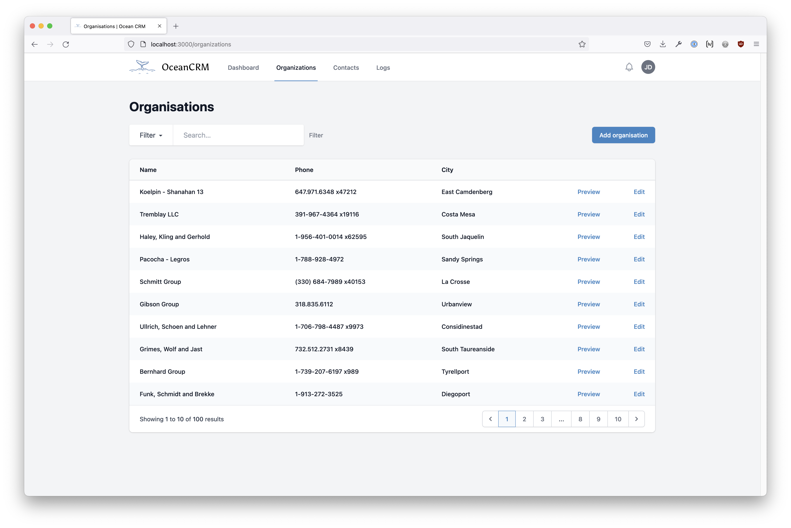

# OceanCRM

A real world example application to demonstrate how luna-js and element-js work. (Inspired by https://github.com/inertiajs/pingcrm)



## Tech-Stack

-   @webtides/luna-js
-   @webtides/element-js
-   prisma
-   tailwindcss

## Installation

Clone the repo locally:

```sh
git clone https://github.com/webtides/ocean-crm.git
cd ocean-crm
```

Install NPM dependencies:

```sh
npm install
```

Setup configuration:

```sh
cp .env.example .env
```

Create an SQLite database. You can also use another database (MySQL, Postgres), simply update your configuration accordingly.

```sh
touch database/content.db
```

Add type `module` to the `package.json` file

> Sorry...

```json
{
    "type": "module"
}
```

Run database migrations and seeder:

```sh
npm run migrate:reset
```

Remove type `module` from the `package.json` file

> Sorry...

```json
{}
```

Run the dev server (the output will give the address):

```sh
npm run dev
```

You're ready to go! Visit OceanCRM in your browser, and login with:

-   **Username:** admin@example.com
-   **Password:** secret

## TODOs

-   Push to GitHub
-   Layout improvements and fixes
    -   Pagination component for more than 6 pages
    -   Logs sorting seems out of order
    -   Impersonation seems broken
    -   Updating Contacts is broken...
    -   Flash messages seem broken
    -   Session seems to be broken or not consistent

## Possible Enhancements

-   Show Logs for User on user detail page
-   Show Log history for resource on detail page
-   Add Model classes for typehints in templates?!
-   Add global sorting to overview lists
-   Add sorting per column for datatables
-   Notifications (for Contacts Pages?) like Flash Messages but more like Toasts
-   Flash messages and Toasts?! Should there be two?! Or just a single pattern?

## luna-js Bugs

-   when rendering serverside, dashToCamel is not working for attribute to property mappings

## luna-js Gotchas and possible Improvements

-   We always need the request inside the layout. Therefor we always have to use "loadDynamicProperties" although we don't need it for the page itself...
-   Pages can't be reactive on the client, which gets limiting quite fast
-   Cannot import anything that uses native node libs... Need to dynamically import... It would be nice if luna-js could figure that out for me!
-   Cannot import anything for the client when using TARGET_BOTH...
-   I think fallback routes are not the right tool for 404 and 500 error pages... First of all I cannot know the difference and second I cannot have the correct http headers... I think luna needs another concept for these kind of routes.
-   When the app gets bigger, creating new pages/components is a lot of typing... I think it would be nice to have some generators via the cli to create pages, components, apis, services etc.
-   Cannot invoke put/delete api handlers via standard form post requests...
-   I would like to add middleware functions (for API routes) just for the eg. delete methods
-   Making RESTful API controllers is quite some boilerplate in terms of creating files and folders... It would be nice to be able to define them from a single file
    -   See https://laravel.com/docs/9.x/controllers#actions-handled-by-resource-controller for example
